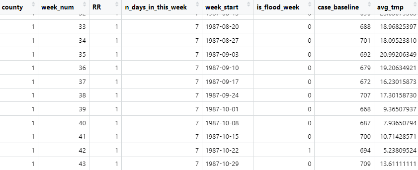
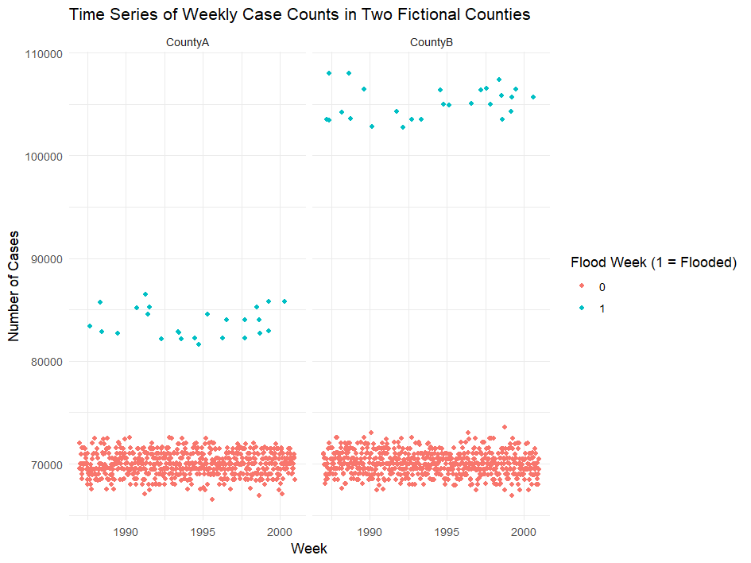
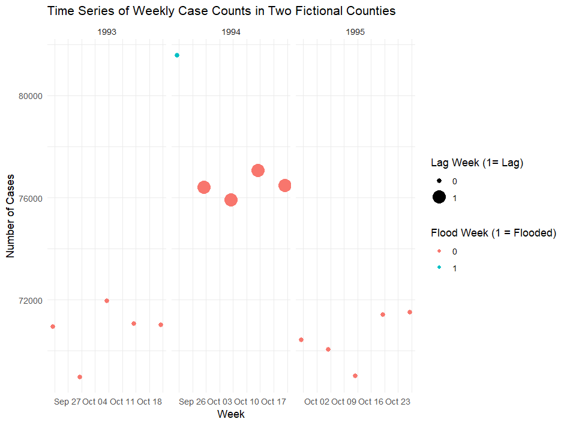
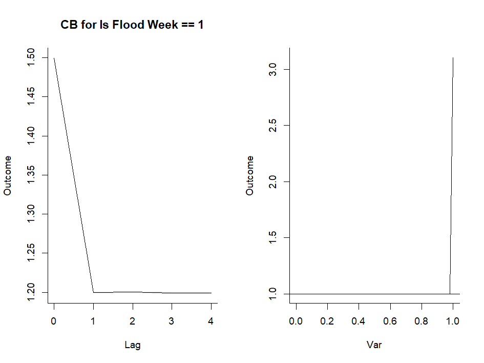
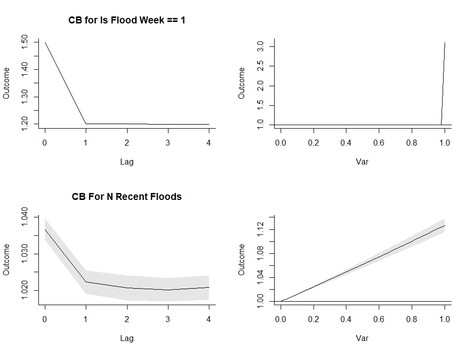

# Exploring the Conditional Quasi-Poisson Approach to Estimate Flooding Health Impacts with Simulated Data
This repository has been developed to demonstrate the process of creating a 'dummy' dataset with simulated event counts and exposure data in order to provide a system for testing modeling assumptions. The provided code is built to explore the impacts of flooding on health outcomes. Flooding impacts on health have been well established in the literature, but have often relied on single-event analysis. The growing availabilty of multimodal flood exposure data such as news catalogs, satellite products, stream gages, and meteorological observations provide the basis for more robust accounting of flood impacts across larger temporal and spatial extents. For a discussion of the available flood literature and an example approach to historical regional flood exposure assessment, see [Khemani et al.](https://iopscience.iop.org/article/10.1088/2752-5309/adedac/meta). The results of the New England-level flood characterization can be downloaded from the [CAFE Climate and Health Collection](https://dataverse.harvard.edu/dataset.xhtml?persistentId=doi:10.7910/DVN/UAYKSU) on Harvard Dataverse. 

This repository was created by [Chad Milando](https://github.com/cmilando/ACRES_flood), then modified by Zach Popp.

Code is separated into five sections that build iteratively toward a more complete pipeline for testing modeling assumptions. A summary of these sections is provided below:

## P1: Building a Dummy Event Count and Exposure Dataset
- Using the chicagoNMMAPS data structure embedded in the dlnm package, a daily event count time series is constructed with capacity for user-defined parameters of baseline count, variance, exposure effects, and time trend.
- Dummy flood events are inserted to the data structure randomly, with additional user-defined parameters of flood frequency and recurrence likelihood.
- The event and exposure data are then aggregated to a weekly event count and weekly marker of exposure.

## P2: Expanding Dummy Data and Inserting Flood Effects
- The data development process is transitioned to a function to allow for more seamless iteration through parameters and developing different inputs across dummy counties.
- For each county, user provided RR estimated for flooding are implemented to the event count time series to approximate flood impacts.
- The resulting event time series with exposure impacts is visualized across the 2 fake counties.

## P3: Adding Lag Effects and Selecting Controls for Conditional Quasi-Poisson Approach
- Script 1 is further modified to integrate a lag effect for flooding, where all four weeks following a flood also see an increase in event counts.
- Script 2 is added to select control weeks for comparison with the flood weeks defined in script 1.
- Following the approach of [Aggarwal et al.](https://arxiv.org/abs/2309.13142), control weeks are selected for the same week-of-year in the years preceding and following a flood event.
- The control selection process is iterative so as to only select control periods of 5 weeks (flood plus lag period) where no flooding was present.

## P4: Cross Basis Definition and Running Single-County Analyses
-  Script 3 is added to define a cross basis which can be used for the dlnm conditional quasi-Poisson implementation. A dichotomous flood effect and polynomial lag are used.
-  Script 1 is modified to take in inputs for RR, flood likelihood, etc. based on user-defined variables from a separate script, to allow for easier iteration through user parameters.
-  Script 4 is added for the application of all of scripts 1-3 and the input of flood, lag, and time trend effects, and baseline case counts with variance.
-  Analytic code is provided to run for a single county, with an approach including manual definition of lag variables and the dlnm cross basis approach.
-  Modeled effects are extracted for comparison with user-provided RR to assess model robustness to different inputs.

## P5: Extension to Account for Consecutive Flood Effect and Multi-County Analyses with Meta-Regression
- Scripts are adjusted to account for an added effect of flooding occurring on consecutive weeks, with each added flood in the past 4 weeks increasing the population health effect.
- Multiple approaches are demonstrated for how to address this affect, including use of a cross basis for linear impacts of additional flood weeks and use of multiple cross basis across distinct flood definitions (single week, two weeks, three-plus weeks).
- Updated analyses are run with user provided effect estimates for consecutive flood weeks. Results can be compared across approaches.
- An additional script is included for running the analysis across counties and performing meta-regression. Results are extracted and visualized.

## Note on Repository Strengths, Limitations, Applications
The code in this repository was developed to allow researchers unfamiliar with the development and application of simulated data for testing model assumptions. The embedded risk estimates in the repository and assumptions on impacts of consecutive flood weeks are not based on the flooding literature or real-world analyses, but are provided as one example that users could iterate to test the robustness of these approaches for extracting health impacts. Note that this system  functions because we have implemented the RR directly into our dummy data. This approach also does not ensure that the model will be appropriate and reveal accurate associations when applied to real data, as 'real' data will differ in the assumptions made in linking the exposure of interest with a health outcome. 

This system provides a space to test how a given modeling approach will handle changes in assumptions. In p5, we will explore how adding an additional effect for floods occurring in consecutive weeks requires changing the modeling approach. To run this analysis, we will need to update all of our scripts to pass in the new assumptions about the relationship between flooding and health. 

## References
Gasparrini A. Distributed lag linear and non-linear models in R: the package dlnm. Journal of
  Statistical Software. 2011; 43(8):1-20. https://doi.org/10.18637/jss.v043.i08
